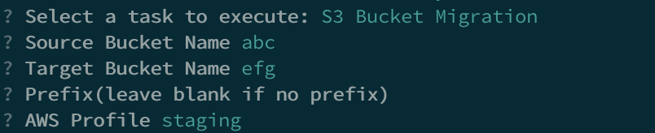
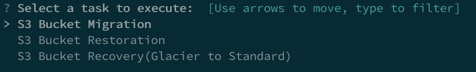

# crazys3

crazys3 solved problem of **s3 bucket migration, data restoration and data recovery**. I encountered the problem when I found I set a wrong lifecycle policy on s3 bucket. Then a huge amount of data(1T or more) was moved to glacier. There is no easy way to recover those data, as aws does not provide any command to restore the whole bucket. And also, you cannot solve this problem with one click on aws console. If you simply iterate objects and restore them one by one, it will take 1 weeks or more(especially when data size is large).


Then I found this [wiki](https://www.linuxschoolonline.com/how-i-could-restore-1-million-files-from-glacier-to-standard-s3/). It seems that a lot of people met the same problem. So I decided to develop this simple tool.




The project relies on aws environment. So please make sure your master machine has `~/.aws/credentials`

## Configuration

```
{
  "master": "localhost", // master public address
  "workers": [
    "localhost1",
    "localhost2"
  ], // worker cluster
  "worker_port": 10086,
  "worker": "localhost" // worker public ip address
}
```
 
## Run the project

### Worker

```
cd crazys3/src
go build worker.go
nohup ./worker &
```

### Master

```
cd crazys3/src
go build master.go
./master 
```

### Output
If you want to recover your file from glacier to standard, please run `S3 Bucket Restoration` at first. Because the prerequisite of recovering is changing file to restored status.


## Conclusion
The speed is depended on how many workers you have. 
